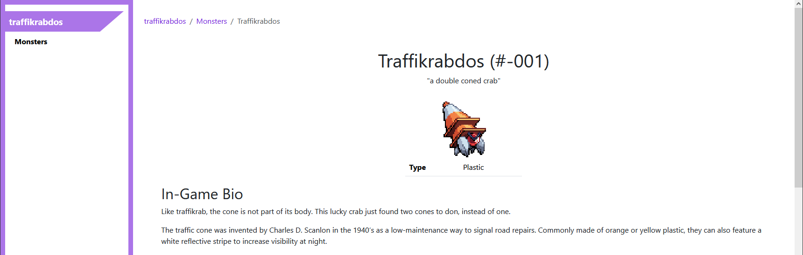

Mod documentation generator
===========================
**cbpickaxe_generate_docs** is a script that allows you to generate HTML documentation of mods. It can automatically create pages with information on monsters, moves, and items added by the mod. As you make changes to your mod, you can use it to make sure that your documentation is up to date with the latest version of your mod. 

.. toctree::
   :maxdepth: 2

   tutorial
   config_file