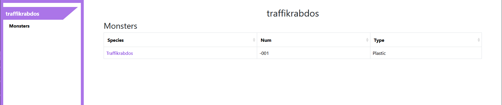

Tutorial
========
This tutorial will walk you step-by-step through the process of setting up and generating documentation for a mod using cbpickaxe.

In this tutorial, we will generate documentation for the `example monster mod (Traffikrabdos) <https://github.com/DeadlyEssence01/CB_example_monster>`_ as an example.

Initial setup
-------------
Before proceding, you will need to make sure you have the following software installed:

* Python
* Git

Additionally you will already need to have `decompiled Cassette Beasts <https://wiki.cassettebeasts.com/wiki/Modding:Mod_Developer_Guide#Decompiling_Cassette_Beasts>`_.

Installing cbpickaxe
--------------------
In order to be able to use cbpickaxe, you will first need to install it.

First you will need to clone the GitHub repository that cbpickaxe is stored in. You can do that by running the following command in the temrinal:

.. code-block:: bash

   git clone https://github.com/ExcaliburZero/cbpickaxe.git

Next you can run the following commands in order to install cbpickaxe:

.. code-block:: bash

   cd cbpickaxe
   pip install -e .

Getting the example mod
-----------------------
Next you will need to get the source code for the example monster mod.

You can do this by running the following command:

.. code-block:: bash

   git clone https://github.com/DeadlyEssence01/CB_example_monster.git

You will also need to make a quick change to the structure of the example mod folder, by running the following commands:

.. code-block:: bash

   mkdir traffikrabdos
   mv CB_example_monster traffikrabdos/mods
   cd traffikrabdos

Creating the docs config file
-----------------------------
In order to generate the documentation for the mod, we will need to create a file that tells the tool where to look for data files and what game elements (monsters, moves, etc.) to document.

To do this, you can run the following command:

.. code-block:: bash

   cbpickaxe_generate_docs new

Then enter the following information:

.. code-block::

   traffikrabdos
   y
   n
   ../Cassette_Beasts

For the last line, you should put the path to your decompiled copy of Cassette Beasts.

If you accidentally type in the wrong path, don't worry, it will be easy to fix it later.

Adding monsters
^^^^^^^^^^^^^^^
Next you will need to tell the tool where to look for the new monster that the example mod adds.

In order to do this, you will need to open up the newly generated `docs.toml` file (in the `traffikrabdos` folder) in a text editor.

In it you should see some lines towards the bottom of the file that look like the following:

.. code-block:: toml

   [monster_forms]
   paths = [
      "res://mods/my_mod/my_monsters/" # TODO: replace with the 'res://...' path to the folder where you keep the monster_form ".tres" files
   ]

You will need to replace the `res://` line like in the following in order to tell the tool where to find the mosnter form file that defines Traffikrabdos.

.. code-block:: toml

   [monster_forms]
   paths = [
      "res://mods/de_example_monster/traffikrabdos.tres"
   ]

Generating documentation
------------------------
Now that we have the configuration file setup the way that we want, we can run the tool and generate some documentation!

To generate the documentation, make sure you are in the `traffikrabdos` folder and run the following command:

.. code-block:: bash

   cbpickaxe_generate_docs build

There should now be a new sub-folder named `docs` with a file called `index.html` and a sub-sub-folder called `monsters`.

You can open up the `index.html` file in your web browser, and should see a page that looks like the following.

You can also click on "Traffikrab" in the table on that page to go to the documentation page for Traffikrabdos.

.. image:: ../images/generate_docs_tutorial_example_monster.png